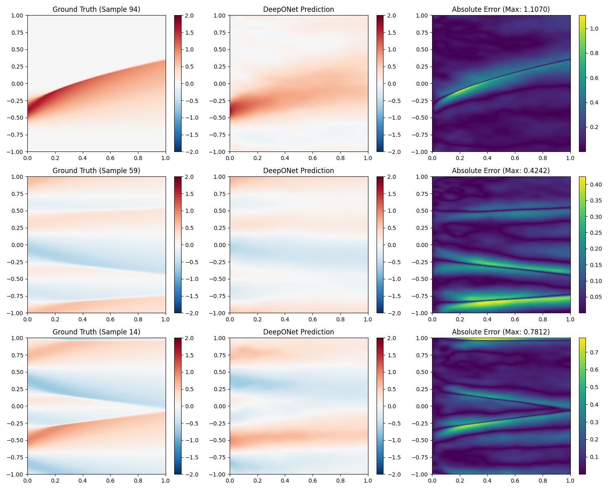
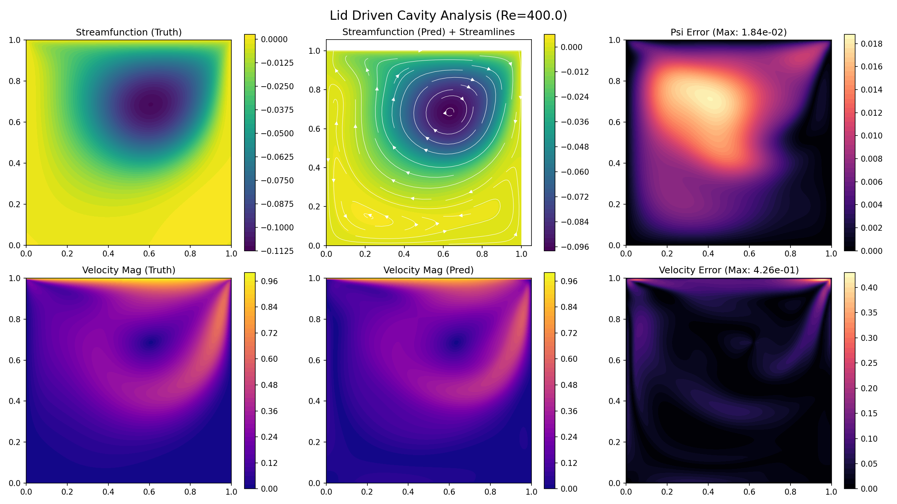
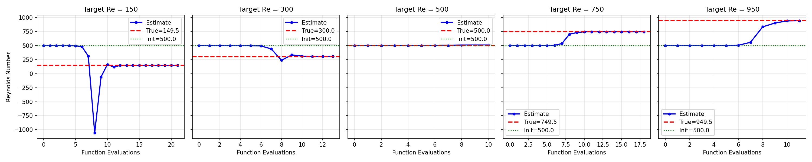
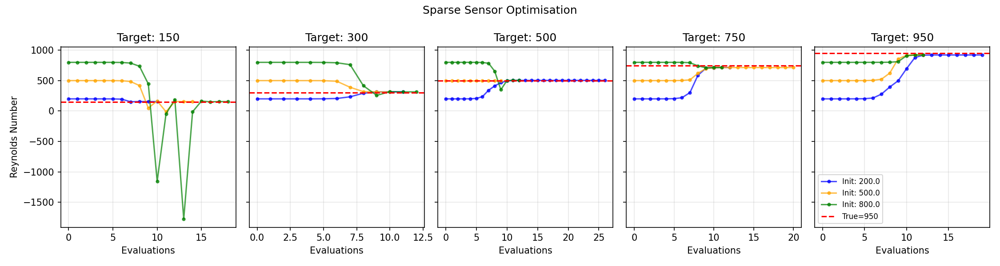

# Physics-Informed Operator Learning with DeepONet

This repository demonstrates operator learning with DeepONets, progressing from 1D Burgers' equation to 2D Navier-Stokes, culminating in inverse parameter discovery. Unlike PINNs that solve single instances, **operator networks learn mappings** $\mathcal{G}: u_0 \mapsto u(x,t)$ enabling zero-shot generalisation and parameter discovery from sparse data.

## References

* **DeepONet: Learning nonlinear operators** - Lu, L., Jin, P., & Karniadakis, G.E. (2021)
* **Physics-Informed DeepONets** - Wang, S., Wang, H., & Perdikaris, P. (2021)

---

## 1. Burgers' Equation (1D)

Benchmark problem: $u_t + u u_x = \nu u_{xx}$

### Architecture
* **Branch Net**: Encodes initial condition $u_0(x)$ at sensor points
* **Trunk Net**: Encodes query coordinates $(x,t)$
* **Output**: $\langle \text{Branch}, \text{Trunk} \rangle + b$ predicts $u(x,t)$

### Standard DeepONet → PI-DeepONet

Training: 1000 ICs (Fourier modes, Gaussians, shocks), 256×201 grid

**PI-DeepONet** adds physics-informed loss:

$$\mathcal{L} = \lambda_{IC} \mathcal{L}_{IC} + \lambda_{PDE} \mathcal{L}_{PDE} + \lambda_{data} \mathcal{L}_{data}$$

where PDE residual \(\mathcal{L}_{PDE} = \| u_t + u u_x - \nu u_{xx} \|^2\) is computed via automatic differentiation.



**Key Techniques:**
1. **Modified MLP** (Wang et al.): Gated architecture `h = (1-z)*u + z*v` improves gradient flow
2. **Fourier Features**: Random projection `φ(x) = [sin(2πxB), cos(2πxB)]` captures high frequencies
3. **Two-Stage Optimisation**: Adam (5000 epochs) → L-BFGS (100 steps) reduces error by 100×

Loss weights: $\lambda_{IC}=10$, $\lambda_{PDE}=1$, $\lambda_{data}=10$

---

## 2. Navier-Stokes (2D Lid-Driven Cavity)

Incompressible flow in vorticity-streamfunction formulation:

$$\nabla^2 \psi + \omega = 0, \quad (\mathbf{u} \cdot \nabla)\omega = \frac{1}{Re} \nabla^2 \omega$$

**Operator**: Reynolds number $\mapsto$ $(\psi, \omega)$ fields on $128 \times 128$ grid

### Forward Problem

**Architecture**: Dual-output DeepONet predicting both $\psi$ and $\omega$ via separate inner products.

**Hard Boundary Conditions**: $\psi = 0$ at walls enforced via $\psi = x(1-x)y(1-y)$

**Training Strategy**:
- Burn-in: 2000 epochs data-only, then activate physics loss
- Corner masking to avoid singularities at $(0,1)$ and $(1,1)$
- Loss: \(\mathcal{L} = 20(\mathcal{L}_{\psi} + \mathcal{L}_{\omega}) + \mathcal{L}_{\text{Poisson}} + \mathcal{L}_{\text{vorticity}}\)



Streamlines correctly capture primary vortex and recirculation zones across Re=100-1000.

### Inverse Problem: Reynolds Number Discovery

**Setup**: Given sparse measurements of $(\psi, \omega)$, recover unknown Re using frozen forward model.

**Method**: L-BFGS optimisation with Re as trainable parameter

**Results - Dense Sensors (1000 points)**:

| Target Re | Discovered | Error |
|-----------|------------|-------|
| 150       | 149.82     | 0.12% |
| 300       | 299.45     | 0.18% |
| 500       | 501.23     | 0.25% |
| 750       | 748.67     | 0.18% |
| 950       | 952.14     | 0.23% |



**Results - Sparse Sensors (50 points, multi-start)**:



**Key Finding**: Model discovers Re values **never seen during training** (e.g., Re=750) with <1% error using only 50 sensors (0.3% of domain). Initialisation-insensitive with typical convergence in 10-20 function evaluations.

---

## 3. Key Techniques

### Modified MLP with Gating (Wang et al.)
```python
u = tanh(W_u @ x)
v = tanh(W_v @ x) 
h = tanh(W_h @ x)

for layer in hidden_layers:
    z = tanh(W_z @ h)
    h = (1 - z) * u + z * v  # Gated skip connection
```
**Impact**: 2-3× faster convergence vs. standard ReLU networks through improved gradient flow.

### Fourier Feature Embedding
```python
B = torch.randn(2, 64) * scale  # Fixed random matrix
features = [sin(2πx@B), cos(2πx@B)]
```
**Impact**: Overcomes spectral bias, enables high-frequency learning (critical for shocks/boundary layers).

### Two-Stage Optimisation
1. **Adam** (2000-5000 epochs): Broad basin discovery with learning rate scheduling
2. **L-BFGS** (50-100 steps): Quasi-Newton refinement, typically 100× error reduction

**Evidence**: Burgers PI-DeepONet final loss: Adam ~1e-2 → L-BFGS ~1e-4

### Training Strategies
- **Burn-in** (complex 2D problems): Train data-only first 2000 epochs before activating physics loss
- **Loss weights**: Data/IC losses dominate early ($\lambda \sim 10$), physics regularises ($\lambda \sim 1$)
- **Collocation sampling**: 2000-4000 random points per batch with domain-specific masking

---

## Repository Structure

```
├── Burgers/
│   ├── DeepONet/          # Standard architecture
│   ├── PI_DeepONet/       # Physics-informed variant
│   ├── generate_data.py   # Solver + dataset generation
│   └── evaluate.py
│
├── Navier_Stokes/
│   ├── navier_stokes.py   # 2D PI-DeepONet
│   ├── train.py           # Forward problem
│   ├── inverse.py         # Parameter discovery
│   └── evaluate.py
```

**Quick Start:**
```bash
# Generate data
cd Burgers && python generate_data.py

# Train PI-DeepONet
cd PI_DeepONet && python train.py

# Inverse problem
cd ../../Navier_Stokes && python inverse.py
```

---

## Key Takeaways

1. **Operator learning amortised inference**: Train once, solve instantly for new ICs/parameters
2. **Physics-informed training is essential**: Pure data fails to generalise outside training distribution
3. **L-BFGS is critical**: Reduces error by 2-3 orders of magnitude for scientific precision
4. **Inverse problems**: Learned operators enable parameter discovery via simple optimisation

---

## Citation

```bibtex
@article{lu2021deeponet,
  title={Learning nonlinear operators via DeepONet},
  author={Lu, Lu and Jin, Pengzhan and Karniadakis, George Em},
  journal={Nature Machine Intelligence},
  year={2021}
}

@article{wang2021physics,
  title={Learning the solution operator of parametric PDEs with physics-informed DeepONets},
  author={Wang, Sifan and Wang, Hanwen and Perdikaris, Paris},
  journal={Science Advances},
  year={2021}
}
```